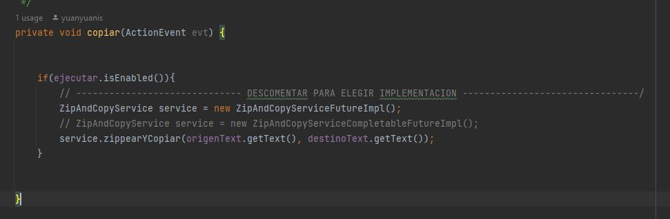
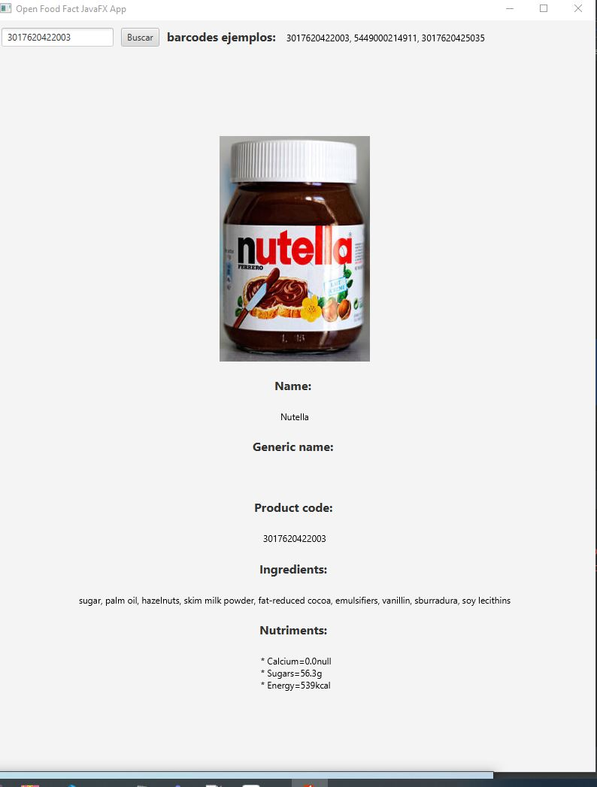

# Feedback2-

- ***Juan Ibáñez Blanco***
- El ejercicio de Feedback2 se presentan los proyectos `JavaFX` como proyectos independientes.
- Los proyectos `Swing`, `stream` y `Observer` estan en en el proyecto `feedback2`. 

##  1.  Observer Aviones [link al código](https://github.com/yuanyuanis/Feedback2/tree/main/feedback2/src/main/java/com/yuanyuanis/concurrente/feedback2/observer/aviones)

Se ha realizado implementación sobre ejercicio original que escuchaba con la clase deprecada en nuevas versiones de Java `Observable`.

En este caso tenemos Avión con la propiedad `PropertyChangeSupport` y AvionPerseguidor que implementa `PropertyChangeListener`.


## 2. ListView [link al código](https://github.com/yuanyuanis/Feedback2/tree/main/ListView/src/main/java/com/yuanyuanis/concurrente/javafx/listview)

Aplicación en JavaFX que muestra un `ListView<Pelicula>` y añade películas en una `ObservableList` actualizable cuando introducimos un item elemento por pantalla.

Código relevante
```java
       // Observable list
        ObservableList<Pelicula> peliculas = FXCollections.observableArrayList();
        listView.setItems(peliculas);

        button.setOnAction(event -> {
            if(validarDatosEntrada(anio, nombrePelicula)) {
                peliculas.add(new Pelicula(Integer.valueOf(anio.getText()), nombrePelicula.getText()));

                nombrePelicula.clear();
                anio.clear();
            }

        });
```

## 3. Streams [link al código](https://github.com/yuanyuanis/Feedback2/tree/main/feedback2/src/main/java/com/yuanyuanis/concurrente/feedback2/streams)

Menú en consola de comandos que en función de la opción seleccionada llama a la clase `CiudadService` que tiene métodos con las implementaciones lambda sobre la colección `CiudadDataSet`. 

.

## 4. Future yCompletableFuture Descargar Ficheros [link al código](https://github.com/yuanyuanis/Feedback2/tree/main/feedback2/src/main/java/com/yuanyuanis/concurrente/feedback2/completableFuture/descargarFicheros)

Aplicación en swing para descarga de archivos vía URL con dos implementaciones que dependen de un `radio button seleccionado`.


    - Future.
    - CompletableFuture.

## 5. Future/CompletableFuture Zip and Copy [link al código](https://github.com/yuanyuanis/Feedback2/tree/main/feedback2/src/main/java/com/yuanyuanis/concurrente/feedback2/completableFuture/copiarYZippear) 

Aplicación en swing para hacer un zip de una carpeta y mover a destino con dos implementaciones. En esta ocasión para lograr las dos implementaciones tenemos que volver a ejecutar cambiando la implementación de la interfaz (descomentar el siguiente código).

    - Future.
    - CompletableFuture.

.

## 6. RestCountries V1 [link al código](https://github.com/yuanyuanis/Feedback2/tree/main/RestCountries/src/main/java/com/yuanyuanis/concurrente/restcountries)

- Implementación básica en JavaFX que llama a la API RestCountries, devuelve los nombres de los países y los lista. 

- Se ha usado `retroFit` en esta y las siguientes versiones.

.

## 7. RestCountries V2 [link al código](https://github.com/yuanyuanis/Feedback2/tree/main/RestCountries2_CountriesDetail/src/main/java/com/yuanyuanis/concurrente/restcountries/restcountries2_countriesdetail)

- V2 de RestCountries, se muestran los detalles. 

.

## 8. RestCountries V3 [link al código](https://github.com/yuanyuanis/Feedback2/tree/main/restCountriesV3/src/main/java/com/yuanyuanis/concurrente/restcountriesv3)

- V3 de RestCountries

- En esta versión se ha usado `rxJava`.

- Código relevante: La carga inicial de datos.

```java
    /**
     * Llamada inicial a la API 
     **/
    @FXML
    public void initialize() {

        // 1) Observable
        countryData = FXCollections.observableArrayList();

        // LLamamos inicial a la API
        countriesService.getAllCountries()
                .flatMap(Observable::from)
                .doOnCompleted(() -> System.out.println("Descarga OK"))
                .doOnError(throwable -> System.out.println(throwable.getMessage()))
                .subscribeOn(Schedulers.from(Executors.newCachedThreadPool()))
                .subscribe(countries -> {
                    // 3) Ponemos los datos.
                    countryData.addAll(countries);
                });


        // 4) Añadir a la tabla
        countryTable.setItems(countryData);
    }
```

- Manejar la lista en memoria y manipularla cuando buscamos filtrando por los campos. Si hubiese alguna actualización en la API sería recargada, se usa lambda para filtrar.


```java
  public void handleSearchButton(ActionEvent actionEvent) {
        String name = nameField.getText();
        Boolean independent = independentCheckBox.isSelected();
        String region = regionField.getText();

        countriesService.getAllCountries()
                .subscribeOn(Schedulers.io())
                .flatMap(Observable::from)
                .filter(country -> {
                    boolean existeName = true;
                    boolean existeIndependent = true;
                    boolean existeRegion = true;

                    if (!name.isEmpty()) {
                        existeName = country.getName().toLowerCase().contains(name.toLowerCase());
                    }

                    if (!region.isEmpty()) {
                        existeRegion = country.getRegion().toLowerCase().contains(region.toLowerCase());
                    }

                    if (independent != null) {
                        existeIndependent = country.getIndependent() == independent;
                    }

                    return existeName && existeIndependent && existeRegion;
                })
                .toList()
                .subscribe(paisesFiltrados -> {
                    // Pasamos a observable los países filtrados
                    countryData = FXCollections.observableArrayList(paisesFiltrados);

                    // Establecemos los países en su tabla
                    countryTable.setItems(countryData);
                });
    }
```

.

## 9. OpenFoodFacts [link al código](https://github.com/yuanyuanis/Feedback2/tree/main/openFoodFactsJavaFX/src/main/java/com/yuanyuanis/openfoodfactsjavafx)

- Proyecto JavaFX
- Se ha usado el jar envoltorio o wrapper del que dispone OpenFoodFacts. 
- Este wrapper en Java llama a la API.

```xml
        <dependency>
            <groupId>pl.coderion</groupId>
            <artifactId>openfoodfacts-java-wrapper</artifactId>
            <version>0.9.3</version>
        </dependency>
```


.


